# 金水Task1 笔记

1.登录后首先选择空间，然后创建项目

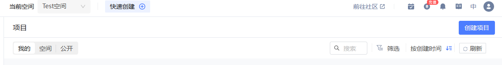

2.创建项目

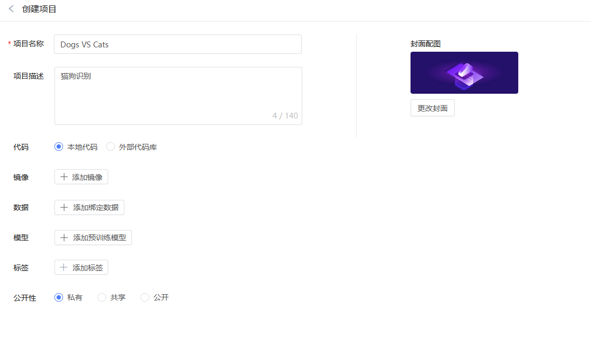

3.添加镜像

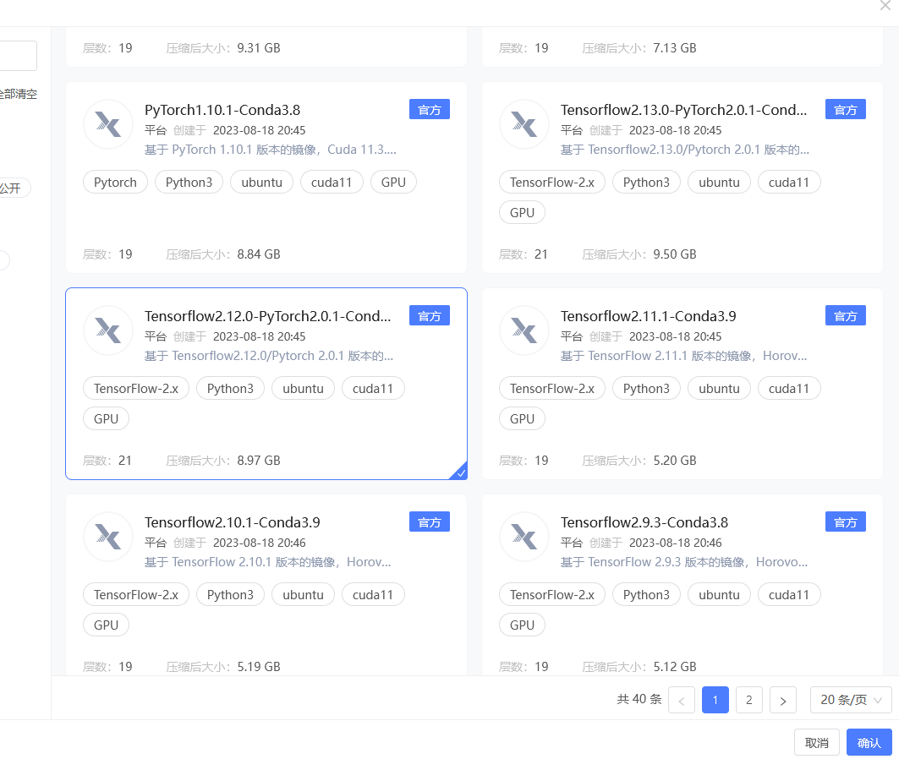

4.添加数据

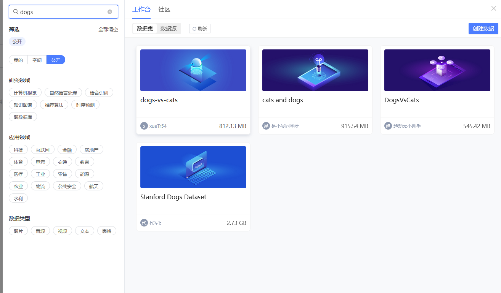

5.上传代码

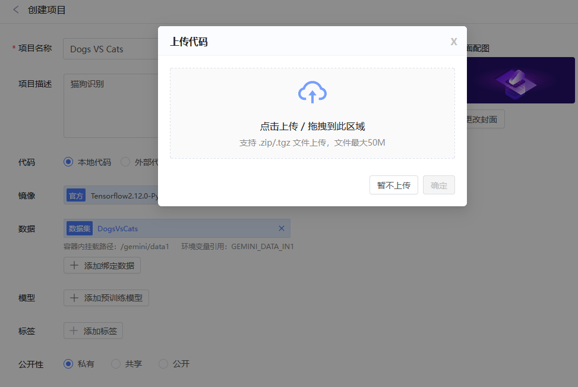

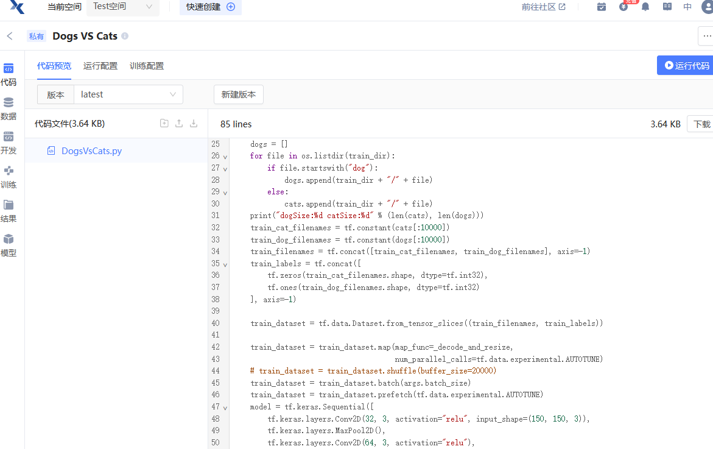

6.初始开发环境

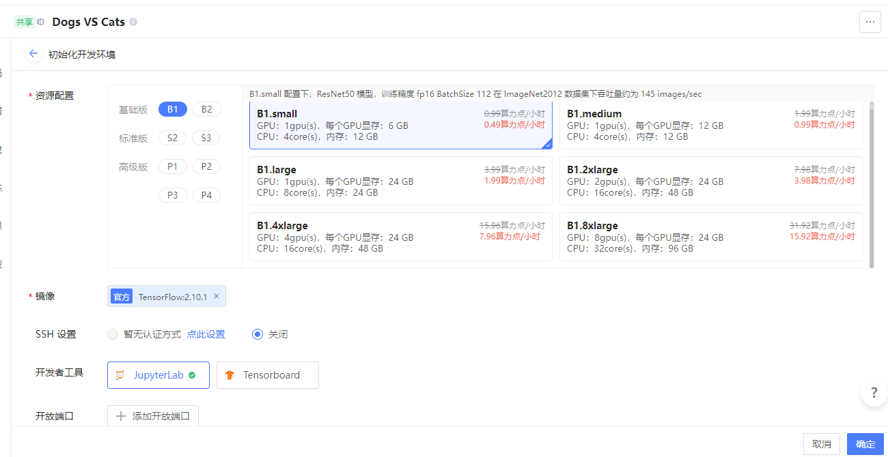

7.等待启动

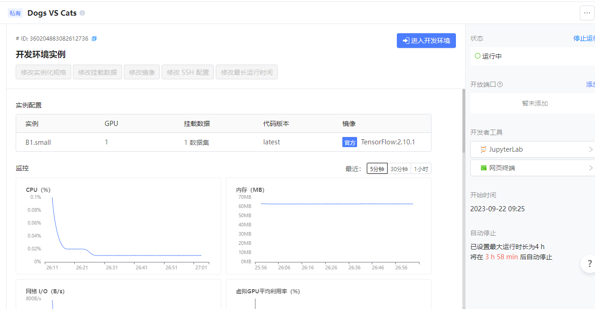

8.调试代码

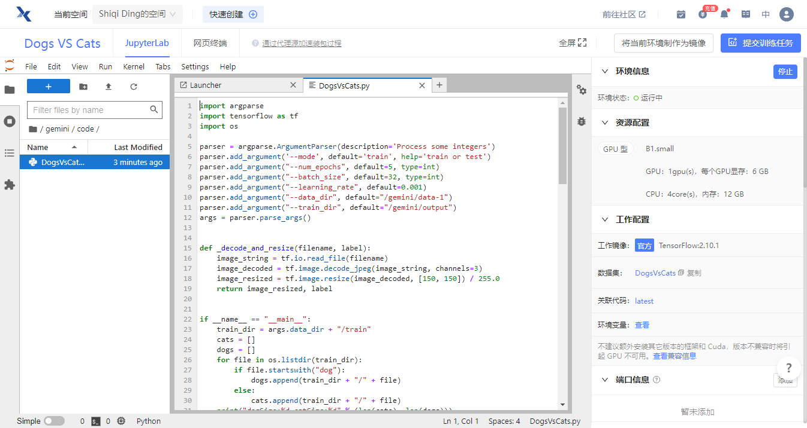

9.进入终端

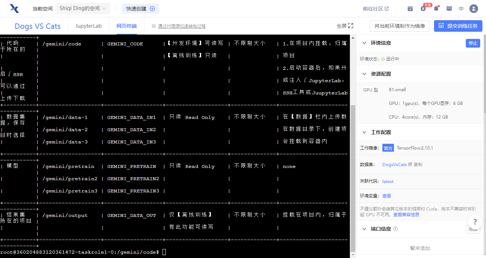

10.得到accuracy 0.5

11.修改第44行，去除注释，按 “Crtl + S” 键，保存该文件，重新运行

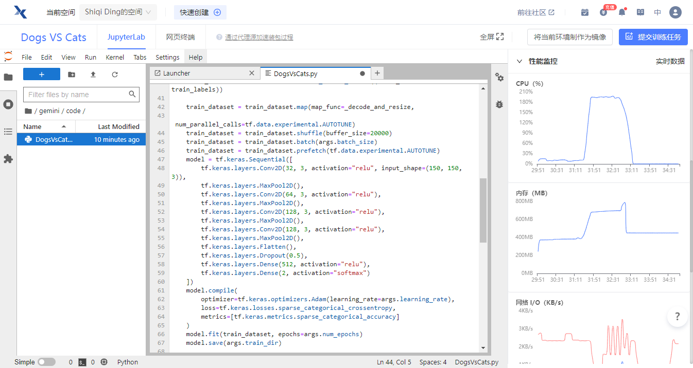

accuracy 到了 0.8694

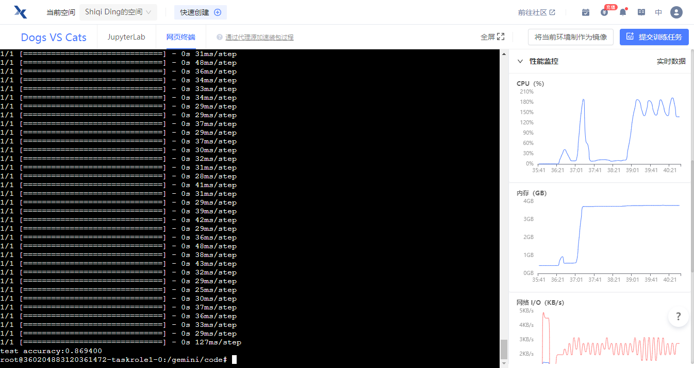

12.提交训练任务

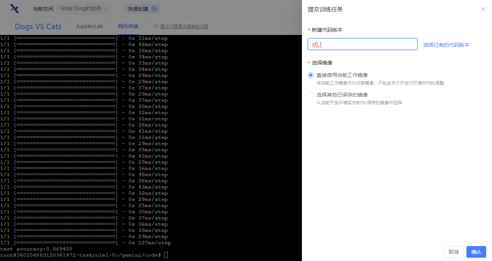

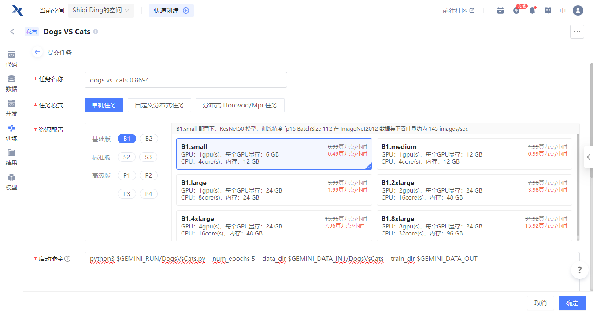

等待

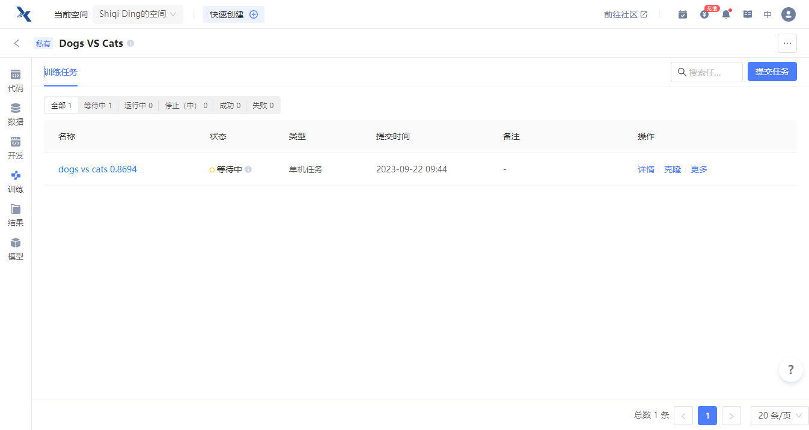

成功啦！

13.在结果-任务结果里可以导出模型

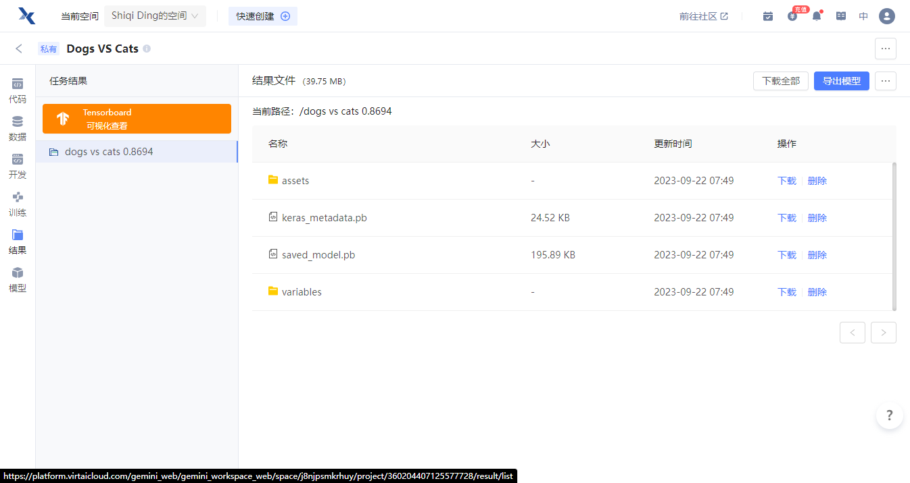

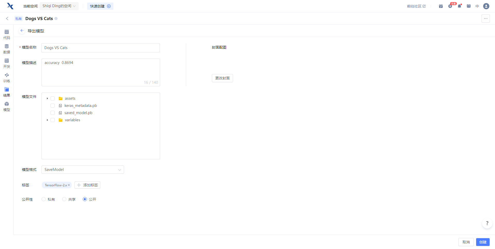

导出成功！

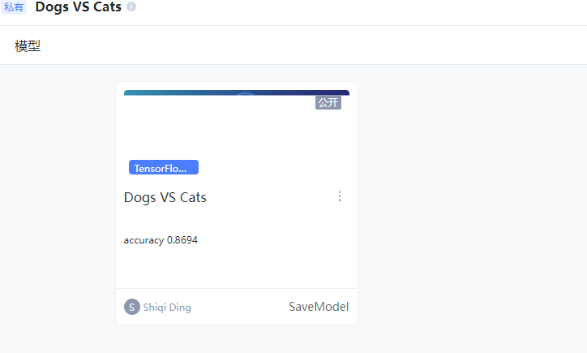